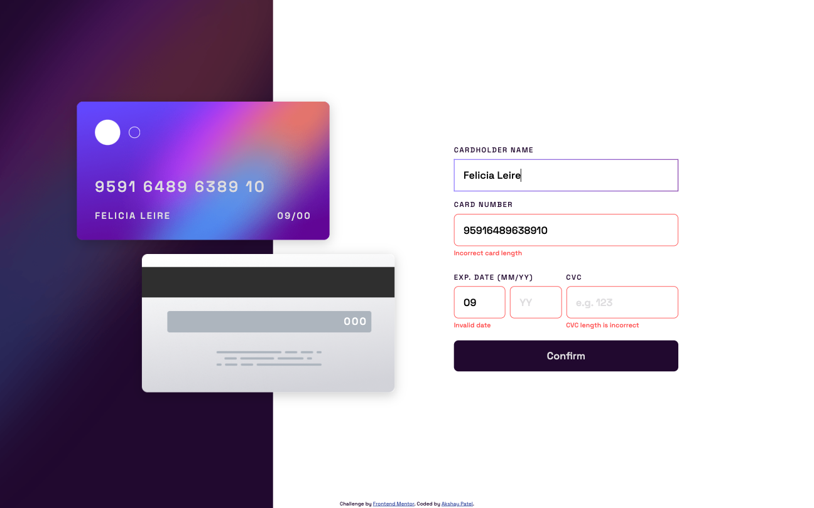

# Frontend Mentor - Interactive card details form solution

This is a solution to the [Interactive card details form challenge on Frontend Mentor](https://www.frontendmentor.io/challenges/interactive-card-details-form-XpS8cKZDWw). Frontend Mentor challenges help you improve your coding skills by building realistic projects.

## Table of contents

- [Overview](#overview)
  - [The challenge](#the-challenge)
  - [Screenshot](#screenshot)
  - [Links](#links)
- [My process](#my-process)
  - [Built with](#built-with)
  - [Learning & Development](#learning-&-development)
- [Author](#author)

## Overview

### The challenge

Users should be able to:

- Fill in the form and see the card details update in real-time
- Receive error messages when the form is submitted if:
  - Any input field is empty
  - The card number, expiry date, or CVC fields are in the wrong format
- View the optimal layout depending on their device's screen size
- See hover, active, and focus states for interactive elements on the page

### Screenshot



### Links

- Solution URL: [https://github.com/akshaypatel99/interactive-card-details-form](https://github.com/akshaypatel99/interactive-card-details-form)
- Live Site URL: [https://akshaypatel99.github.io/interactive-card-details-form/](https://akshaypatel99.github.io/interactive-card-details-form/)

## My process

### Built with

- Semantic HTML5 markup
- CSS custom properties
- Flexbox
- Mobile-first workflow

### Learning & Development

Practicing and reinforcing my knowledge of HTML, CSS and JS.

```css
input:focus {
	border-width: 1px;
	border-style: solid;
	border-image-source: var(--linear-gradient);
	border-image-slice: 1;
	border-radius: 8px;
}
```

```js
function updateCardNumber(value) {
	let parts = [];
	for (let i = 0; i < value.length; i += 4) {
		parts.push(value.substring(i, i + 4));
	}
	let str = parts.join(' ');
	if (str.length > 19) return;
	imageCardNumber.innerHTML = str;
}

function validateExpiryDate(monthValue, yearValue) {
	const d = new Date();
	const month = d.getMonth();
	const year = d.getFullYear().toString().slice(2, 4);

	if (yearValue > year) return true;
	if (yearValue === year) {
		console.log('here');
		if (monthValue > month) return true;
	}
	return false;
}

function validateCVC(cardNumberValue, cvcValue) {
	// First validate for AMEX
	if (cardNumberValue.length === 15) {
		return cvcValue.length === 4;
	}
	return cvcValue.length === 3;
}
```

## Author

- Website - [Akshay Patel](https://www.akshaypatel.dev)
- Frontend Mentor - [@akshaypatel99](https://www.frontendmentor.io/profile/akshaypatel99)
- Twitter - [@laidbackak](https://www.twitter.com/laidbackak)
